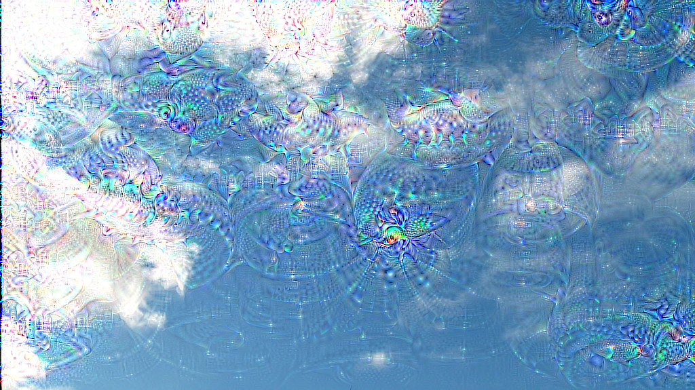
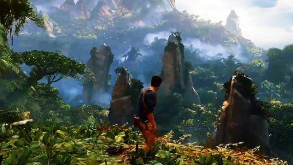
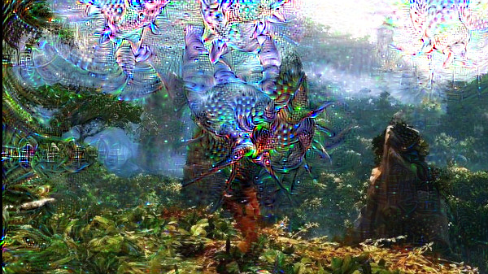
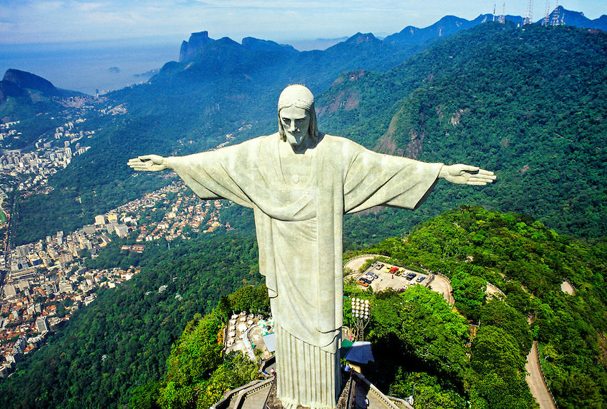
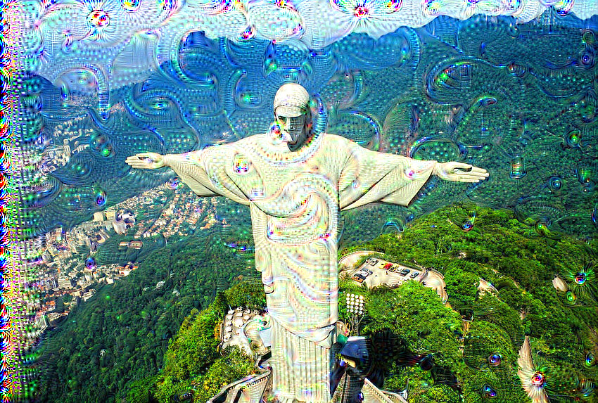
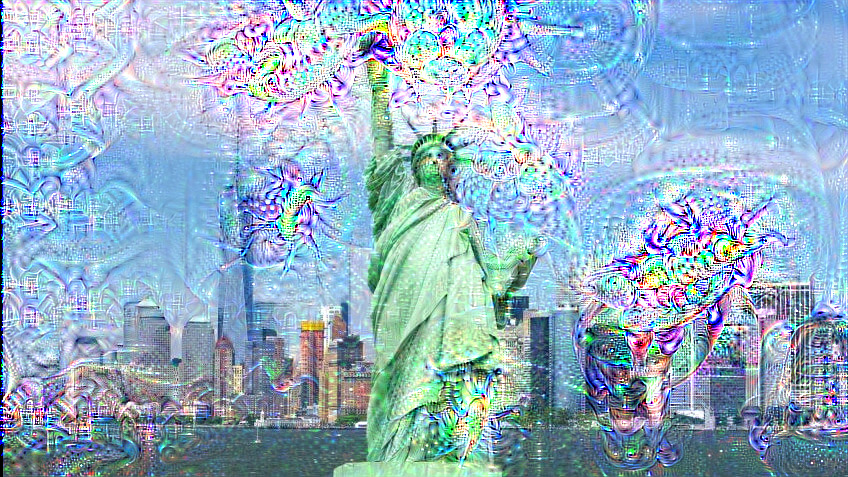
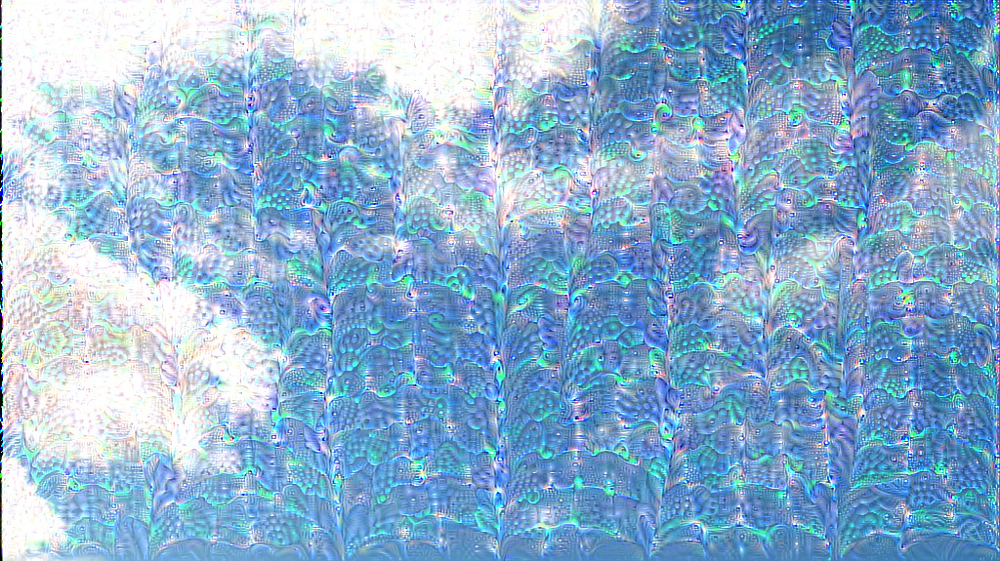

# DeepDream

**NOTE : If there is no GPU support available please checkout the cpu
branch of this repo. The cpu code is not thoroughly tested.**

## INSTALLATION INSTRUCTIONS

Run this command in the `Julia REPL`
```julia
julia> Pkg.clone("https://github.com/avik-pal/DeepDream.jl.git")
```

## USAGE INSTRUCTIONS

1. Inorder to generate dreams without using octaves run the following
   command with your own parameters
```julia
julia> img = load_image("./examples/sky.jpg")
julia> load_model(5)
julia> DeepDream.make_step(img, 10, 0.005, true, "./examples/sky_dream_new.jpg")
```
Make sure to pass all the arguments to the make_step function call to
avoid errors. Refer to the [function definition](https://github.com/avik-pal/DeepDream.jl/blob/11ef038ec6333114e521c6d6b422a4831c6bb0c8/src/dream.jl#L5) to understand what each parameter means.

2. To make use of octaves run the following commands
```julia
julia> img = load_image("./examples/sky.jpg")
julia> load_model(5)
julia> deepdream(img, 10, 0.005, 1.4, 4, "./examples/sky_dream_new.jpg")
```
Also be sure to checkout the [function definition](https://github.com/avik-pal/DeepDream.jl/blob/11ef038ec6333114e521c6d6b422a4831c6bb0c8/src/dream.jl#L27)

3. Incase you want to use any other model than the VGG19 model make sure
   to pass a function to `load_model()` which returns the model you want
   to use

4. To generate guided dreams run the following code.
```julia
julia> img = load_image("./examples/sky.jpg")
julia> guide = load_guide_image("./examples/rio.jpg")
julia> load_model(5)
julia> deepdream(img, 10, 0.005, 1.4, 4, "./examples/sky_dream_guided_new.jpg", guided = true)
```
The `guided_step` function might be used independently like the
`make_step` function.

5. Even easier method is to place all your images in a `./images`
   directory and call the function `dream_batch` function. Send a
   guiding image if necessary.

## SOME EXAMPLES
|Original Image|Generated Image|
|:---:|:---:|
|||
|||
|||
|||
|||

|Original Image|Guiding Image|Generated Image|
|:---:|:---:|:---:|
||||
||||

## IMPLEMENTED

1. Utilities to load, save and generate images
2. Perform operations on Image
    * Zoom
3. Utilities to load models
4. Deep Dream Generator (non-guided)
5. Generate deep dreams using Octaves
6. Guided Deep Dreams

## CURRENT BOTTLENECKS

* The image zoom is performed in CPU as the present implementation is
    too slow for GPUs. So it can be quite slow
* The guided image dreaming is quite slow due to a lot of indexing
    operations
